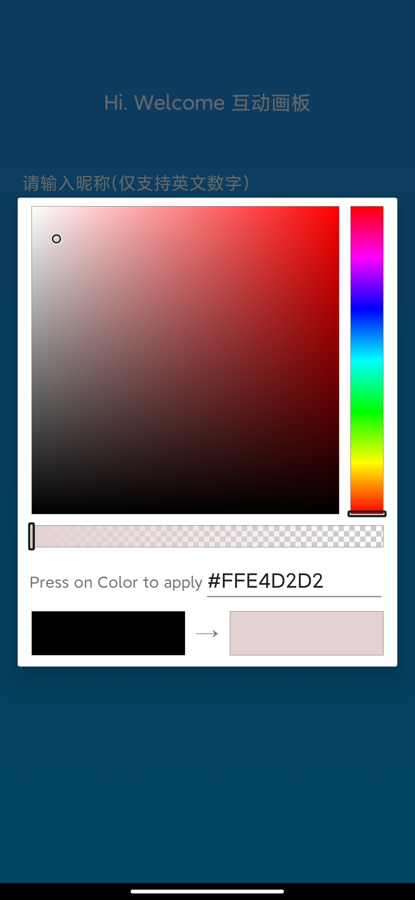
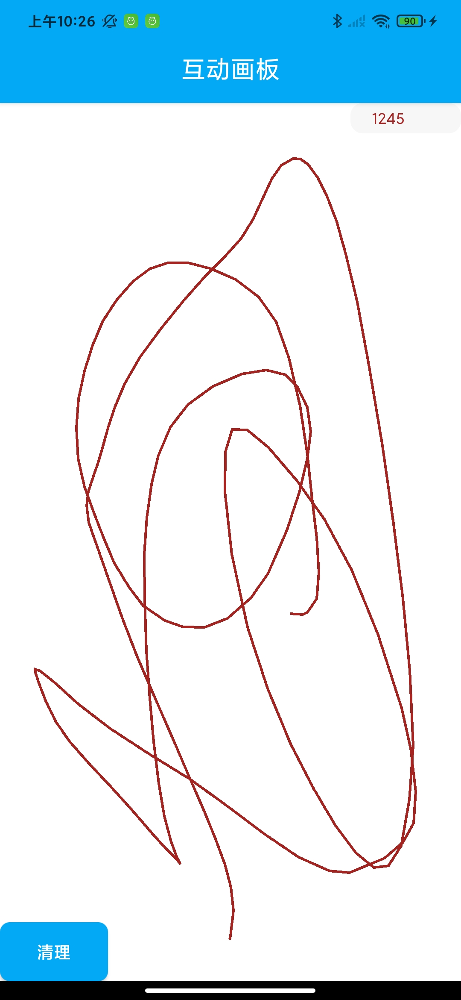

# Task-4-Android-HOTIM
基于环信MQTT开发的互动画板项目

# 项目介绍：

该项目完全基于mqtt实现，没使用任何服务器

## 采用相关：

1. 采用环信IM用户系统，搭建用户登录与注册，并通过环信用户系统来构建用户数据

2. 采用环信mqtt服务

## 运行特点：

1. 数据全部存储在每个客户端上，通过mqtt来实时同步数据

2. 登录采用昵称登录（10位以内英文），选择画笔颜色（选择好了将不能更改）

3. 画板全部客户端同步，只可以清除自己的画笔

使用说明：

安装包下载：
[drawingboard.apk.apk](assets/drawingboard.apk)

登陆后需要等待数据同步完成，才能进行下一步

图片说明：

登录页面：（输入昵称）

登录页面：（选择颜色）

登录页面：（选择完颜色）

主功能页面： （主页，画板）

